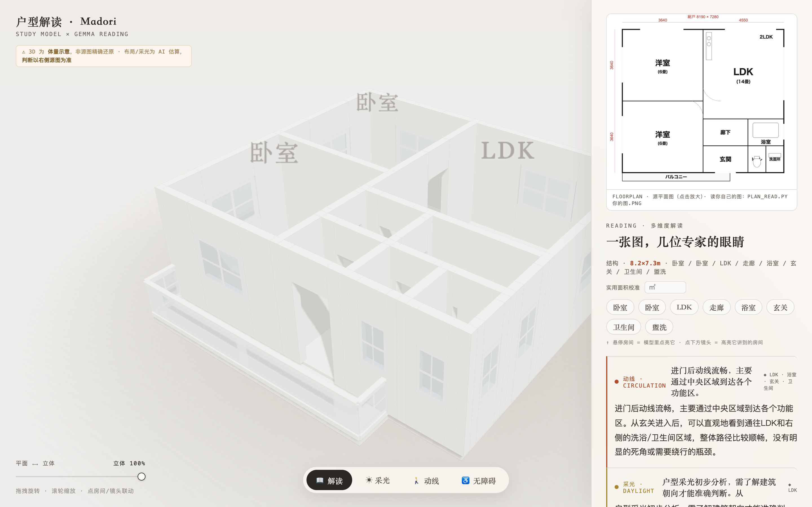
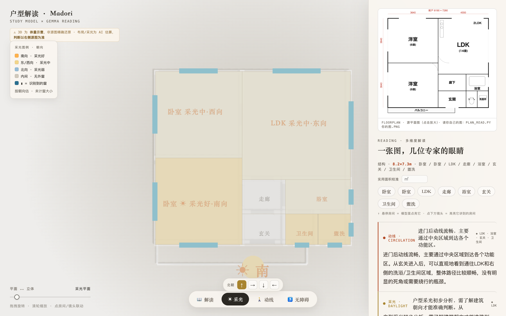
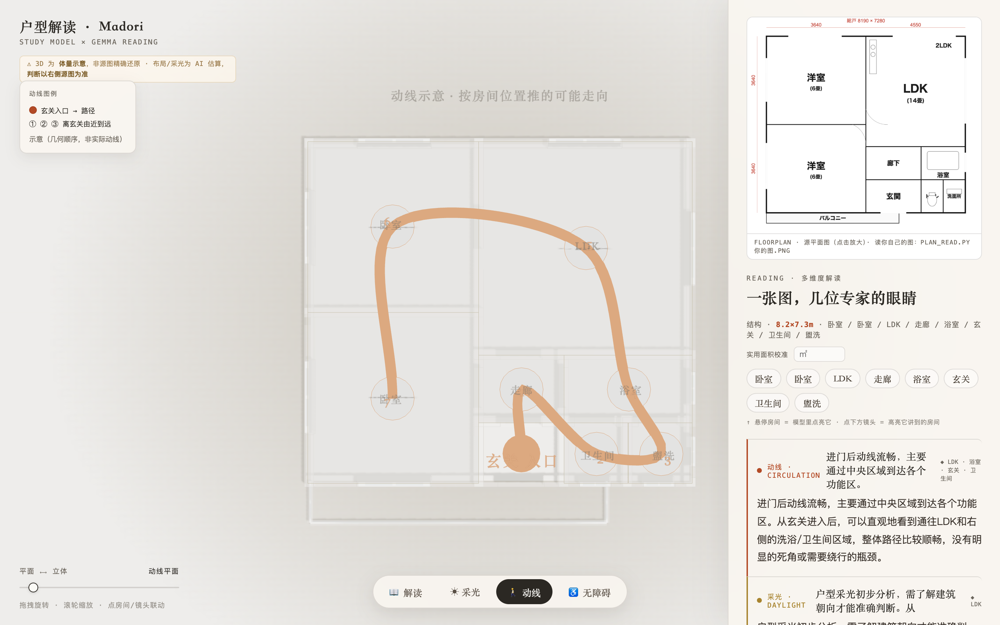
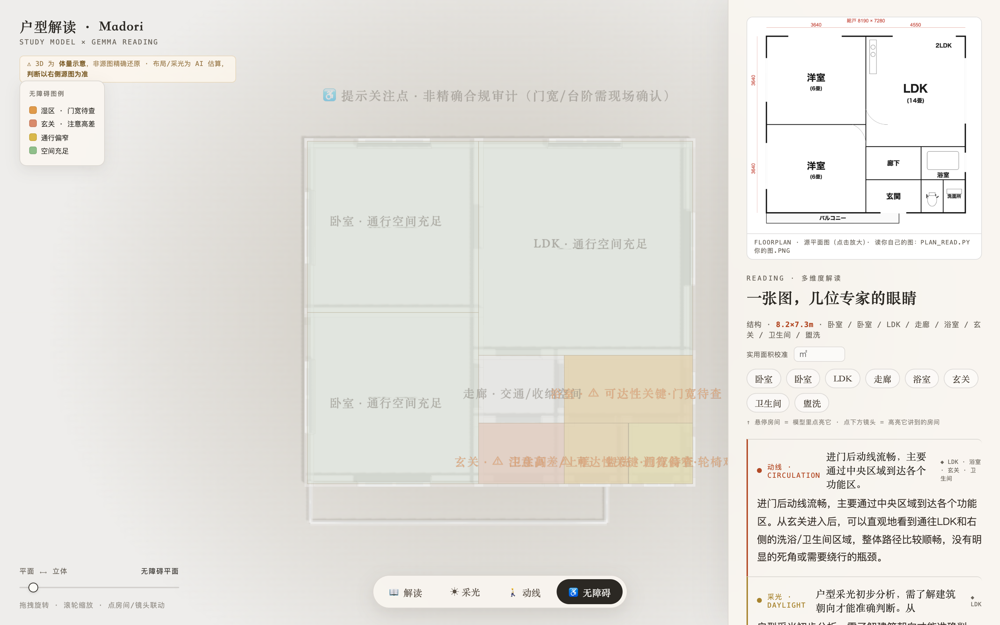
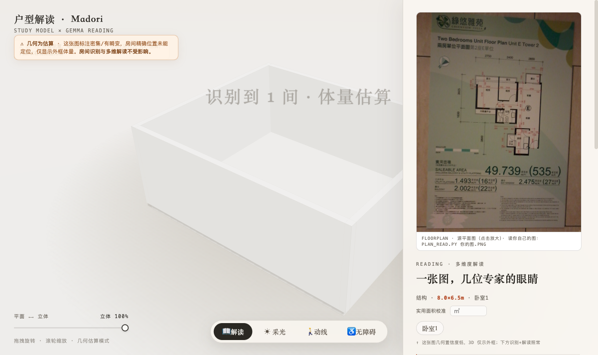

[中文](README.md) · **English**

# Madori — AI That Reads Any Floor Plan

> Most people look at a floor plan and only see "how many rooms." What's written on it, what's missing, where the traps are — they can't tell.
> **Madori takes an architect's "ability to read a plan" and turns it into something anyone can see at a glance.**

   



> One floor plan → a rotatable 3D white model + switch a view, and professional analysis is drawn directly onto the plan.

**Switch a view, and you get one of an architect's eyes:**

| 📖 Read | ☀ Daylight | 🚶 Circulation | ♿ Accessibility |
|---|---|---|---|
| Room detection + five expert lenses (circulation / daylight / accessibility / walkthrough / critique), click a room for live highlighting | Pick the north orientation and **deterministically compute** each room's daylight grade — a computed fact, not a guess | Path from the entrance + arrival order, see at a glance how you move once inside | Flags concerns for elderly / wheelchair users: wet zones, level changes, passages too narrow |

<p>
  
</p>

**Two engines, one product** — local `gemma4:e4b` (private · free · offline) ⟷ cloud `gemma-4-31b` (larger · more complete extraction). The same Gemma 4 orchestration, choose privacy or precision per scenario. Geometry is locked and validated by code against the extracted structure (understanding goes to the LLM, computation goes to code) — never guessed by the model.

🎬 **[Demo video](web/demo/madori-demo.mp4)** &nbsp;·&nbsp; 🖥 **[Try the white model online](web/madori.html)** &nbsp;·&nbsp; 📄 **[Technical report](TECHNICAL_REPORT.en.md)**

> **🌐 About the online demo**: it is a **live showcase of one floor plan** (interactive — rotate 3D / switch daylight / click rooms).
> **To read YOUR own plan** → one local command: `./run.sh your-plan.png`. Gemma runs on **your machine** and the plan **never leaves it** (privacy-first), producing an analysis page for your specific image.
> Why no in-browser upload? Because Gemma runs locally (the whole point of "privacy/offline") — a browser can't run the model. This is a deliberate local-first trade-off, not a missing feature.

---

## What it is

**Madori** is a tool that uses a local Gemma 4 multimodal vision model to read floor plans (**間取り図 / floor plan**).

You give it an image — maybe a **floor plan** posted by a real-estate agent, maybe the plan of your own home (PNG / JPG / single-page PDF) — and it **understands** the image like an architect would, then explains it in plain language (for non-architects) through several professional "lenses":

- **Structure** — what rooms exist, their dimensions, the overall layout.
- **Circulation** — how you move and live in this home, where you get stuck, where you detour.
- **Daylight** — which rooms get sun. **Honesty first**: if the plan doesn't mark orientation (N/E/S/W), it says "unknown" outright — it never guesses.
- **Accessibility** — door widths, steps, reachability of the bathroom / toilet. Is this home usable for an elderly or wheelchair user?
- **Daily-life walkthrough** — a plain-language "living tour": you enter here, the living room is over there, walking you through it.
- **Critique** — one strength, one weakness (each with on-plan evidence), and one concrete, actionable improvement.

Beyond the text reading, Madori also generates a white **3D "study model" (massing)** from the plan, letting you drag a slider between **flat ⟷ 3D** to **see with your own eyes** the volume and layering of the home — instead of imagining it from a flat drawing.

**Two run modes, your choice:**

- **Local privacy mode** (default): Ollama + `gemma4:e4b`, fully on-device, nothing uploaded — your home never leaves your computer.
- **Cloud precision mode**: calls `gemma-4-31b` (still Gemma 4, just larger), with more complete room extraction and more stable naming. Geometry is still locked and validated by code against the extracted structure — use it when you need a more accurate layout.

Both modes share the same `extract → lock → multi-lens` orchestration (below). **Privacy-first → local, precision-first → cloud** — a real-world reflection of the division of labor between an edge small model and a cloud large model.

---

## Four views · Handing you an architect's eyes

**Core mission: take what an architect reads "at one glance at a drawing" and turn it into something anyone can see at a glance.** Not walls of text to read, but analysis drawn directly onto the 3D plan — switch a view and the professional insight surfaces on the drawing.

- **📖 Read** — room detection + plain-language reading through five professional "lenses" (circulation / daylight / accessibility / walkthrough / critique); click a room or a lens and the corresponding spot in the model lights up live.
- **☀ Daylight** — set the north orientation, and each room's daylight grade is **computed deterministically** based on which exterior wall it touches and which way it faces: south = warm orange (good), east/west = yellow (medium), north = blue (weak), interior = gray (no window). Where an architect "glances at orientation to judge daylight," you see at a glance which rooms get sun. **This is a computed fact — rotating north recomputes it live.**
- **🚶 Circulation** — starting from the entrance, a path line runs through the rooms + numbered arrival order, so you see at a glance "how you move once inside." (Indicative routing, inferred from room positions.)
- **♿ Accessibility** — flags concerns for elderly / wheelchair users: wet zones (door width TBD), entrance (level change), passages too narrow. See at a glance where this home may be unfriendly. (Flags concerns; door widths / steps need on-site confirmation.)

When switching views, the camera **transitions smoothly** and auto-tops-down into a flattened zoning map; the right panel lets you **enter the usable floor area** to calibrate real dimensions.

> **Honesty grading**: daylight is a **deterministic geometric computation** (made real); circulation / accessibility are **indicative / hints** (clearly labeled, not posing as precise). Dirty images that can't be read accurately are **auto-downgraded** to an outline + a note — never a misleadingly precise model.

---

### Honest downgrade (edge-case handling)



> Feed it a **densely annotated / photo-distorted** dirty image (geometry confidence `low`, fill ratio 0.12) and the 3D **won't** force a deceptively precise model — it falls back to a white outline + a top "⚠ geometry is estimated" warning, noting that "room detection and multi-dimensional reading are unaffected." **Clean image = precise white model, dirty image = honest outline** — two outputs of the same confidence gate.

---

## Why it matters (social value)

This is not a tech-demo toy. It addresses a real, widespread, and unfair information gap.

**Most ordinary people actually can't read a floor plan.** Yet it's precisely from these few drawings that people make the biggest housing decisions of their lives — renting, buying. In front of landlords and agents, those who can't read a plan are inherently at an information disadvantage: what's written on it, what's missing, where the traps are — they can't see it. **What Madori wants to do is hand an architect's "ability to read a plan" to everyone, for free and privately.**

Specifically, it's especially useful for:

- **Families facing a super-aged society.** Japan is aging fast. The **accessibility** lens helps families judge, **before an on-site visit**, whether a home is safe and livable for an elderly or disabled family member — are doors wide enough, are there steps, can you get into the toilet.
- **People deciding on housing remotely.** Those who **can't visit in person** due to relocation, study abroad, or being overseas — who can only judge from drawings — Madori helps them read the plan thoroughly.
- **People who can't afford a consultant.** Fully local = private + free. This "ability to read a plan" shouldn't be a privilege only for those who can pay consulting fees.

---

## Scalability

Madori's scalability isn't a slogan — it's three layers of scaling built into the architecture:

1. **Any plan, zero code changes** — `extract → lock → multi-lens` is plan-agnostic: Gemma 4 reads both the lines (visual) and the room names/dimensions (in-image text) at once, so **any floor plan, in any annotation language** runs through the same pipeline — not a single line of "for-this-specific-image" hardcoding.
2. **Privacy ⟷ precision, scaled by one variable** — the same Gemma 4 orchestration switches between local `e4b` (offline / private / free) and cloud `31b` (high precision / high throughput) via a single `MADORI_MODEL` env var, with no change to business logic. Privacy-first individuals run local; batch-precision needs go cloud.
3. **Real buildings across all of Japan** — Leg B's geometry comes from PLATEAU open data + deterministic grid codes (JIS X 0410): any coordinate → auto-locate and fetch the building, **no per-building modeling needed**, covering the whole country by construction.

Deployment: the pipeline is stateless, so cloud mode scales horizontally; local mode runs on a consumer Mac (M4 Pro 24GB) — one machine is the whole product.

---

## How to use

**Prerequisites**: [Ollama](https://ollama.com) installed locally, with the Gemma 4 multimodal model pulled.

```bash
# 1. Start the Ollama service
ollama serve

# 2. Pull the Gemma 4 multimodal model (e4b, sized for local VRAM)
ollama pull gemma4:e4b
```

**Read a floor plan**:

```bash
# Pass in a floor plan (PNG / JPG / single-page PDF)
python3 pipeline/plan_read.py samples/floorplan.png
```

The script will:

1. Print each lens's reading in the terminal (structure / circulation / daylight / accessibility / daily-life walkthrough / critique);
2. Auto-generate and open an **HTML report** that lays out all lens readings together for easy review.

**View the 3D white model**:

The 3D massing (flat ⟷ 3D slider) is a web page — just open it in a browser:

```bash
# Serve the web/ directory with any static server
python3 -m http.server 8000 --directory web
# Visit http://localhost:8000 in the browser
```

Drag the **flat ⟷ 3D** slider and the plan rises into a white massing model, with rooms labeled by the names read from the drawing.

**(Optional) Cloud precision mode** — for more complete room extraction + a more accurate layout, use the larger cloud Gemma 4 (geometry still locked and validated by code):

```bash
echo "GOOGLE_AI_KEY=your-key" > .env.local                                       # Google AI Studio key (gitignored, not committed)
python3 pipeline/plan_read.py samples/madorizu_1f.png                            # local e4b: five-lens text reading
MADORI_MODEL=gemma-4-31b-it python3 pipeline/madori3.py samples/madorizu_1f.png  # cloud 31b: extract precise geometry
python3 pipeline/precise_to_reading.py                                          # merge → precision web/madori.html
```

---

## How Gemma 4 is used

The core capability of this project **is Gemma 4's vision** — it reads the drawing, and that act itself is the entire product. Without it understanding the image, nothing stands. This is a project where multimodality is the lead, not a garnish (**Track B / Multimodal**).

But "can read an image" is not the same as "reads it accurately and consistently." Throwing the whole image at the model at once to narrate six lenses easily causes **drift** — the same room gets called "master bedroom" when discussing circulation, then "bedroom A" when discussing daylight; the two don't line up and the whole reading becomes untrustworthy.

So there's a deliberate engineering orchestration here — **extract → lock → multi-lens**:

1. **Extract (once)**: first let Gemma 4 do just one thing — pull the **structure** out of the image: what rooms exist, their dimensions.
2. **Lock (as context)**: **lock** that extraction into a fixed context (room list + dimensions) that doesn't change afterward.
3. **Multi-lens (run each lens with the locked context)**: every lens afterward (circulation / daylight / accessibility / daily-life walkthrough / critique) runs **carrying the same locked context**. So all lenses use **one shared set of room names** and never diverge.

**The division of labor is clear**: every "judgment" is made by Gemma 4 (reading the image, interpreting, critiquing); while **state management, the lens loop, and failure retries** are orchestrated by code. The LLM handles understanding; the code keeps the process stable and consistent.

It's precisely this **extract → lock → multi-lens** orchestration that lets Madori give a **consistent, interrogable, honest reading** — rather than the off-the-cuff output of a single one-shot prompt.

---

## Honest boundaries

This honesty is itself part of the product. Please read this section carefully.

- **It's a "design-literate" reading, not a professional certification.** Madori gives a "help-you-understand" aid; it is **not** the structural judgment of a licensed structural engineer, nor a formal accessibility-compliance audit.
  ⚠️ **For any decision involving law, safety, or structure, please consult a licensed professional.** Madori is a starting point for understanding, not a basis for signing off.
- **Orientation unmarked → daylight says "unknown."** When the drawing doesn't mark N/E/S/W, daylight analysis can only offer limited info. In that case the AI explicitly says "unknown" — it **will not** fabricate a plausible-sounding orientation to fool you.
- **Room coordinates are approximate.** Room positions / dimensions extracted from the image are estimates, so **the 3D white model and room labels are "indicative,"** not survey-grade. Don't use them to estimate construction or put down a deposit.
- **Best suited to clean listing-style plans with room-name text labels.** It reads cleanest on tidy real-estate floor plans that spell out "living room / bedroom / kitchen" (the model relies on reading those labels to identify rooms). **Known out of scope** (results unreliable — will downgrade or misread): ① densely annotated color plans (area m² numbers get confused with coordinates); ② dark-background CAD technical drawings (dense lines + furniture symbols + often no room names); ③ plans with no room-name text at all. Don't rely on the geometry output for these.

---

## Real-building mode (Leg B)

The above is "**floor plan → reading**." Madori has a second leg: "**real building → real white model + real reading**."

The core reversal: **don't reconstruct 3D from a single photo** (single-image reconstruction only yields a bounding box, losing all form — tested). Instead, **photo/address → locate → fetch this building's geometry from an existing real 3D database**. Hand geometry to a place that actually has geometry; let Gemma do what it's strongest at: recognition + understanding.

```bash
# 1) Locate: get coordinates from photo EXIF GPS (fill in manually if a screenshot has no GPS)
python3 pipeline/locate.py photo.jpg              # or --lat 35.6638 --lng 139.5872

# 2) Auto-pick mesh: coordinates → Japan standard grid code (deterministic, JIS X 0410) → fetch PLATEAU CityGML
python3 pipeline/geo.py --lat 35.6638 --lng 139.5872

# 3) Real white model: extrude CityGML footprint + height (fully local, renders offline, no key, no cloud)
python3 pipeline/plateau_parse.py <that.gml>      # generates and opens web/plateau_view.html

# 4) Real daylight: coordinates = orientation → compute deterministically (no guessing)
python3 pipeline/real_read.py <that.gml>          # facade orientation distribution / west-sun / solar elevation

# 5) Gemma qualitatively reads a real-building photo (massing / materials / context / critique, can overlay real daylight)
python3 pipeline/building_read.py photo.jpg --lat 35.6638 --lng 139.5872
```

**Leg B incidentally fixes Leg A's hard limit**: a floor plan with no orientation → daylight can only say "unknown"; plug in real coordinates → **daylight becomes a computable fact** (this is a qualitative leap).

**Data source**: [PLATEAU](https://www.mlit.go.jp/plateau/) (Japan's nationwide 3D city model from the Ministry of Land, Infrastructure, Transport and Tourism; CityGML open data, CC BY 4.0). Download once and it runs **fully offline**, no API key, no cloud. LOD1 = extruded massing (white-model bare); city centers have LOD2 (with roofs).

> ⚠️ Leg B honest boundaries: the real white model is LOD1 massing (not survey-grade, no facade detail); generic cities (outside cached areas) require fetching the corresponding data via the PLATEAU data catalog; daylight is a deterministic geometry + solar-path computation — a fact about "orientation and sun angle," not a replacement for professional insolation analysis.

---

## Project structure

```
madori/
├── pipeline/
│   ├── plan_read.py        # Leg A: floor plan extract→lock→5 lenses + generate reading.html / white model
│   ├── locate.py           # Leg B: photo EXIF GPS → lat/lng (locate)
│   ├── geo.py              # Leg B: lat/lng → Japan grid code → fetch PLATEAU CityGML (deterministic)
│   ├── plateau_parse.py    # Leg B: CityGML footprint+height → web/plateau_view.html white model
│   ├── real_read.py        # Leg B: coordinates+geometry → real-orientation daylight (deterministic)
│   └── building_read.py    # Leg B: real-building photo → Gemma qualitative reading + daylight overlay
├── web/
│   ├── index.html          # Leg A 3D white model: flat ⟷ 3D slider
│   ├── massing.template.html  # Leg A white-model template (footprint extrusion)
│   ├── plateau.template.html  # Leg B real white-model template (CityGML extrusion)
│   ├── plateau_view.html      # Leg B generated real-building white model (example: 20 buildings in Tokyo)
│   └── real3d.html         # Leg B streaming 3D Tiles viewer (Google/PLATEAU, online tier)
├── samples/
│   └── floorplan.png       # example floor plan
└── README.md
```

- **`pipeline/`** — Python orchestration layer. Local `gemma4:e4b` calls, extract→lock→multi-lens state/retry, CityGML parsing, deterministic daylight, HTML generation.
- **`web/`** — pure front-end white-model viewer (global three.js): Leg A floor-plan extrusion, Leg B real-building extrusion, both draggable/rotatable, flat ⟷ 3D.
- **`samples/`** — example data.

---

## In one line

**Ordinary people make the biggest decisions of their lives in front of a floor plan they can least read. Madori uses the eyes of a local Gemma 4 to hand an architect's ability to read a plan to everyone — for free and privately.**
