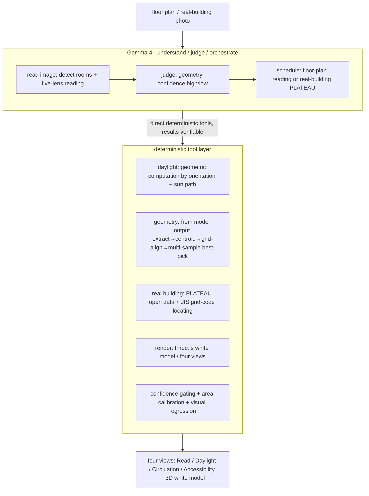

[中文](TECHNICAL_REPORT.md) · **English**

# Madori (間取り) Technical Report

> Track B · Multimodal — using Gemma 4's multimodality to bring an architect's "floor-plan reading" down to something anyone sees at a glance

---

## 1. Project overview

**Ordinary people make the biggest housing decision of their lives — renting, buying — in front of a floor plan they can least read.** Madori uses Gemma 4's multimodal vision to read a floor plan (間取り図 / floor plan) like an architect, then draws the professional analysis **directly onto the drawing**, so an ordinary person sees at a glance: which rooms get good daylight, how you move once inside, whether it's friendly to an elderly person or wheelchair, what the design does well or badly — instead of paragraphs of unreadable text.

The core deliverable is **four "see-at-a-glance" views** (📖 Read / ☀ Daylight / 🚶 Circulation / ♿ Accessibility) + a white 3D study model. It runs fully locally (privacy), and the core model is Gemma 4.

---

## 2. Model selection rationale

### Why Gemma 4
The essence of the task is **visual understanding** — reading the rooms, text annotations, and spatial relationships in an image, and making architectural judgments with common sense. Gemma 4's native multimodality (Text + Image) covers exactly this; and its open weights let us **deploy locally**, which is decisive for the privacy requirement of "floor plans never go to the cloud."

### Two specs: the privacy–precision trade-off
We deliberately adopt **two tiers of Gemma 4**, corresponding to two real trade-offs:

| Tier | Spec | Runs on | Positioning | Trade-off |
|---|---|---|---|---|
| **Privacy** | `gemma4:e4b` (edge, multimodal) | local Ollama (runs on M4 Pro 24GB) | plan never leaves the machine, free, offline | limited geometric precision (small models are weak at exact coordinates) |
| **Precision** | `gemma4:26b` / `31b` (multimodal) | local high-VRAM or cloud AI Studio | accurate room-layout reconstruction | going to the cloud weakens "fully local," but greatly improves geometry quality |

**This selection is evidence-driven**: we first validated the whole pipeline with e4b, but found small models hit a ceiling on "reading out each room's exact polygon coordinates" (rooms overlap, scale drifts). We then validated large-tier Gemma 4 (31b) — it can **precisely reconstruct 15 rooms' polygons** from a standard 間取り drawing, with positions, scale, and shared adjacent edges all matching the source. **Conclusion: the geometry ceiling is not a Gemma 4 capability problem — it's a spec problem**; a larger Gemma 4 (still Gemma 4, compliant) solves it. Keeping both tiers lets the user choose between "privacy first" and "precision first."

---

## 3. System architecture

### Core principle: Gemma 4 as the orchestrating brain, not a model called raw

**Madori's core design is one division of labor: understanding and judgment go to Gemma 4, deterministic computation goes to code.** We did not throw the floor plan straight at a multimodal model and "ask for the answer" — that's simple model concatenation, with output that's neither controllable nor verifiable. Instead, we treat **Gemma 4 as the system's orchestrating brain (orchestrator)**: it understands the image, makes judgments, decides scheduling, then directs a layer of **deterministic tools** to execute the parts it's not good at but a program can compute exactly.



### A few "understanding → LLM, computation → code" divisions
- **Daylight** is not the model "glancing and guessing which room is good" — rather, Gemma reads the orientation, then code **computes it deterministically** from facade direction and sun path. It's a verifiable fact, not a number the model made up.
- **Geometry**: Gemma reads the image and gives room polygons (the large tier performs excellently, precisely reconstructing the source), then code does the deterministic cleanup of **centroiding, grid alignment, multi-sample quality scoring** — the model handles "understanding where it is," the code handles "aligning and squaring it up."
- **Confidence** is judged jointly by Gemma and geometric validation: when it can't read accurately, the system **auto-downgrades** to an outline + honest annotation, rather than outputting a model that looks precise but is imagined.

### extract → lock → multi-lens (drift-proof orchestration)
A multimodal model narrating multiple dimensions in one pass easily **drifts** (the same room is "master bedroom" for circulation, "bedroom A" for daylight). We eliminate this with code-side state management:

1. **Extract**: first let Gemma 4 extract the structure once (what rooms exist, coordinates)
2. **Lock**: lock the result into a fixed context (room list + dimensions)
3. **Multi-lens**: every analysis lens runs **carrying the same locked context** → all lenses share one set of room names, consistent front-to-back and interrogable

### Why design it this way
A multimodal large model's strength is understanding and common sense; its weakness is exact numbers and consistency. Outsourcing the latter to a deterministic program makes the output **verifiable and reproducible**, and roots out "hallucinated numbers." This is exactly the *transcending simple model concatenation* that Track B asks for — Gemma 4 here is not a called black box, but a **system brain that judges, schedules, and honestly backs off when uncertain**.

---

## 4. Multimodal depth

- **Input modalities**: floor plan (image) + in-image room text annotations (OCR done by the model) + (Leg B) real-building photo EXIF GPS.
- **Cross-modal fusion**: the model reads both "lines/walls (visual)" and "room names/dimension numbers (text)" at once, fusing them into a structured spatial understanding that then drives the four analysis views — not a simple juxtaposition of visual and text results, but **visual → structure → multi-dimensional semantic reading**, a deep pipeline.
- **Making the daylight view real**: after choosing the north orientation, each room — by which exterior wall it touches, whether that wall has a window, and which way it faces — gets its daylight grade **computed deterministically**, painted onto the plan in warm/cool color blocks. This is the collaboration of Gemma (recognizing windows/orientation) × geometric tools (computing).

---

## 5. Social value (real impact)

This is not a flashy toy; it solves a real, widespread, and unfair information gap:

- **Most ordinary people can't read a floor plan**, yet they make their biggest renting/buying decisions in front of one. Facing landlords and agents, those who can't read a plan are inherently disadvantaged. Madori aims to hand an architect's "ability to read a plan" to everyone, **for free and privately**.
- **Families in a super-aged society**: the accessibility view can judge, from the drawing before an on-site visit, whether a home is friendly to an elderly person / wheelchair.
- **People deciding on housing remotely** (relocation, study abroad, overseas): they can only judge from drawings — Madori helps them read it thoroughly.
- **Privacy as a hard requirement**: fully local (e4b) = the floor plan never leaves the machine, a real security guarantee for handling private home information.

---

## 5.5 Scalability

Scalability is guaranteed by the architecture, not bolted on afterward — three layers each scale independently:

- **Data axis (any plan, drop-in)**: `extract → lock → multi-lens` is decoupled from any specific floor plan — zero "for-this-image" hardcoding. Gemma 4's multimodality consumes both the visual (lines/walls) and in-image text (room names/dimensions) at once, so **across plan types and annotation languages** everything runs through the same pipeline; supporting a new kind of drawing = 0 lines of code.
- **Model axis (privacy↔precision scaling)**: the same orchestration switches between local `gemma4:e4b` and cloud `gemma-4-31b` via a single `MADORI_MODEL` env var, with zero change to business logic. The small model keeps privacy/offline/free; the large model adds precision/throughput — both Gemma 4, capability scaling with spec (empirically validated: 31b precisely reconstructs 15 rooms).
- **Scenario axis (all of Japan's real buildings)**: Leg B geometry comes from PLATEAU open data + deterministic grid codes (JIS X 0410); any coordinate auto-locates and fetches the building, **no per-building modeling**, covering the whole country by administrative grid.

**Deployment scaling**: the pipeline is stateless and the deterministic tool layer is pure functions, so cloud mode scales horizontally; local mode is a complete product on a single consumer Mac (M4 Pro 24GB) — both the privacy end and the scale end hold.

---

## 6. Honest engineering (this is part of the product, and an engineering highlight)


> Above is a real run: feed a photo-distorted dirty image (`GEOM: low`, fill ratio 0.12) and the 3D auto-downgrades to an outline + "⚠ geometry is estimated," while room detection and the five-lens reading still output normally.

- **Confidence downgrade**: when dense annotations / photo distortion make geometry unreadable, the 3D does not render a deceptively fine model — it falls back to a clean outline + a "geometry is estimated" note.
- **Honesty grading**: daylight is a **deterministic geometric computation** (made real); circulation/accessibility are **indicative/hints** (clearly labeled, not posing as precise); the 3D white model is always "massing indication · not a source-accurate reconstruction."
- **No fabricated numbers**: what the drawing doesn't mark (orientation / door width) the model says is "unknown" — it won't fabricate a plausible-sounding answer.
- **Visual regression tests**: `pipeline/visual_regression.mjs` auto-screenshots the four views × desktop/mobile against a baseline to prevent UI regressions.

---

## 7. Reproduction

```bash
pip install -r requirements.txt
./run.sh                    # one-shot: start Ollama → pull Gemma 4 → read sample → serve four-view web page
# or specify an image: ./run.sh samples/floorplan.png
```

Test material is in `samples/README.md` (with source and licensing). Primary demo: `samples/madorizu_1f.png` (a standard Japanese 間取り plan).

---

**In one line**: Madori uses Gemma 4 as the orchestrating brain to direct deterministic tools, handing an architect's ability to read a plan to every ordinary person — for free, privately, and honestly.
