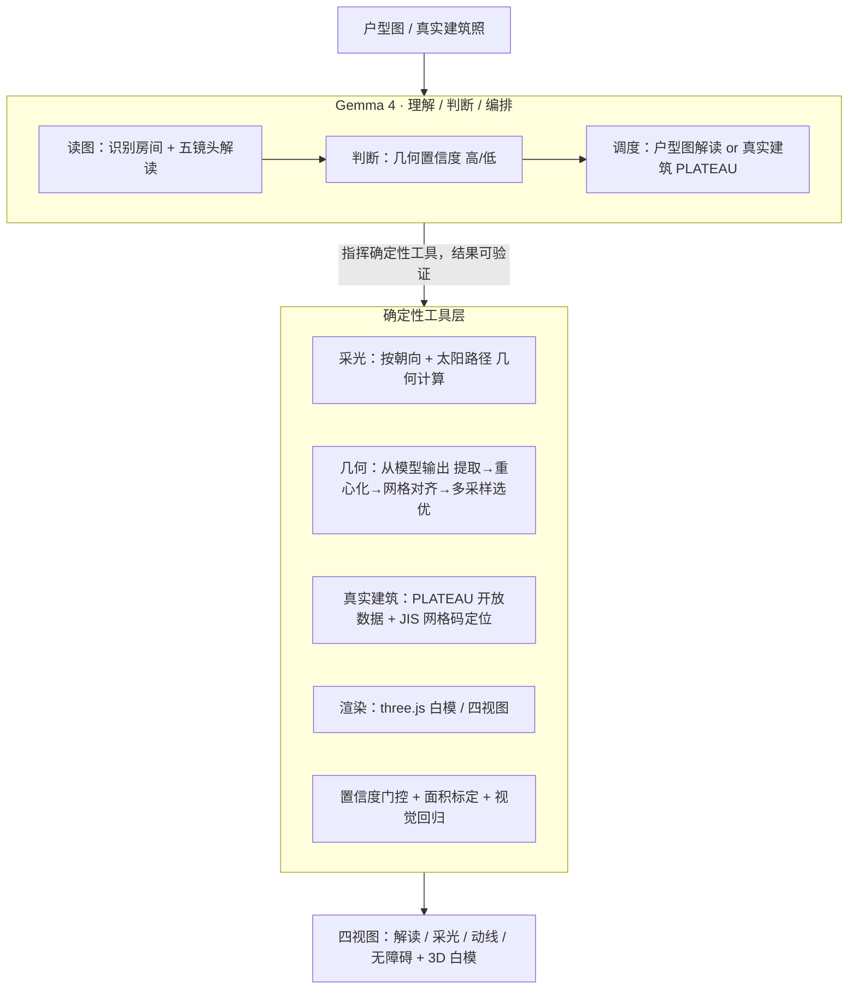

**中文** · [English](TECHNICAL_REPORT.en.md)

# Madori（間取り）技术报告

> 赛道 B · Multimodal — 用 Gemma 4 多模态把建筑师"读户型图"的能力降维给普通人一眼看到

---

## 1. 项目概述

**普通人对着户型图做出人生中最大的居住决定（租房、买房），却最读不懂它。** Madori 用 Gemma 4 的多模态视觉，像建筑师一样读懂一张户型图（間取り図 / floor plan），再把专业分析**直接画在图上**，让普通人一眼看到：哪些房间采光好、进门怎么走、对老人轮椅是否友好、设计有什么优缺点——而不是给一段段读不懂的文字。

核心交付是**四个"一眼可见"的视图**（📖 解读 / ☀ 采光 / 🚶 动线 / ♿ 无障碍）+ 一个白色 3D study model。全程可本地运行（隐私），核心模型是 Gemma 4。

---

## 2. 模型选型理由

### 为什么是 Gemma 4
任务的本质是**视觉理解**——读懂一张图里的房间、文字标注、空间关系，并用常识做建筑判断。Gemma 4 的原生多模态（Text + Image）正好覆盖这件事；而它的开放权重让我们能**本地部署**，这对"户型图不上传云端"的隐私诉求是决定性的。

### 双档规格：隐私与精度的权衡
我们刻意采用**两档 Gemma 4**，对应两种真实取舍：

| 档位 | 规格 | 跑在哪 | 定位 | 取舍 |
|---|---|---|---|---|
| **隐私版** | `gemma4:e4b`（edge，多模态） | 本地 Ollama（M4 Pro 24GB 可跑） | 户型不出本机、免费、离线 | 几何精度有限（小模型对精确坐标弱） |
| **精度版** | `gemma4:26b` / `31b`（多模态） | 本地大显存 或 云端 AI Studio | 房间布局精确还原 | 上云弱化"全本地"，但几何质量大幅提升 |

**这个选型是被实证驱动的**：我们先用 e4b 验证了整条 pipeline 可跑，但发现小模型在"精确读出每个房间的多边形坐标"上有天花板（房间会重叠、尺度漂移）。随后验证大档 Gemma 4（31b）——它能从一张标准間取り图里**精确还原 15 个房间的多边形**，位置、尺度、相邻共享边都对得上源图。**结论：几何天花板不是 Gemma 4 的能力问题，是规格问题**；用更大的 Gemma 4（仍是 Gemma 4，合规）即可解决。两档并存，让用户在"隐私优先"和"精度优先"之间自选。

---

## 3. 系统架构

### 核心原则：Gemma 4 作为编排大脑，而非被裸调的模型

**Madori 的核心设计是一句分工：理解与判断交给 Gemma 4，确定性计算交给代码。** 我们没有把户型图直接丢给一个多模态模型去"要答案"——那是简单的模型拼接，输出既不可控也不可验证。相反，我们把 **Gemma 4 当作系统的编排大脑（orchestrator）**，由它理解图像、做出判断、决定调度，再指挥一层**确定性工具**去执行它不擅长、但程序能算准的部分。



### 几个"理解归 LLM、计算归代码"的分工
- **采光**不是让模型"看一眼猜哪间好"，而是 Gemma 读出朝向后，由代码按立面方位与太阳路径**确定性算出**——它是可验证的事实，不是模型编的数字。
- **几何**由 Gemma 读图给出房间多边形（大档表现出色，精确还原源图），再由代码做**重心化、网格对齐、多采样质量评分**的确定性规整——模型负责"看懂在哪"，代码负责"对齐摆正"。
- **置信度**由 Gemma 与几何检验共同判断：读不准时系统**自动降级**为外框 + 诚实标注，而不是输出一个看似精确实则臆想的模型。

### extract → lock → multi-lens（防漂移编排）
多模态模型一次性讲多个维度时容易**前后漂移**（同一个房间，讲動線叫"主卧"、讲採光又叫"卧室 A"）。我们用代码的状态管理消除它：

1. **Extract**：先只让 Gemma 4 抽取一次结构（有哪些房间、坐标）
2. **Lock**：把结果锁定为固定上下文（房间清单 + 尺寸）
3. **Multi-lens**：每个分析镜头都带着**同一份锁定上下文**去跑 → 所有镜头共用一套房间名，前后一致、可被追问

### 为什么这样设计
多模态大模型的强项是理解与常识，弱项是精确数值与一致性。把后者外包给确定性程序，既让输出**可验证、可复现**，又从根上避免了"幻觉数字"。这正是赛道 B 所要求的 *transcending simple model concatenation*——Gemma 4 在这里不是一个被调用的黑盒，而是一个**会判断、会调度、会在不确定时诚实退让**的系统大脑。

---

## 4. 多模态深度

- **输入模态**：户型图（图像）+ 房间文字标注（图内 OCR 由模型完成）+（腿 B）真实建筑照片的 EXIF GPS。
- **跨模态融合**：模型同时读"线条/墙体（视觉）"与"房间名/尺寸数字（文字）"，融合成结构化的空间理解，再驱动四个分析视图——这不是把视觉结果和文字结果简单并列，而是**视觉 → 结构 → 多维语义解读**的纵深处理。
- **采光视图的"做实"**：选定北朝向后，每个房间按它贴哪面外墙、那墙是否有窗、朝哪个方位 → 确定性算出采光等级，并以暖/冷色块画在平面上。这是 Gemma（识别窗/朝向）× 几何工具（计算）的协同。

---

## 5. 社会价值（Real Impact）

这不是炫技玩具，解决的是一个真实、普遍、不公平的信息差：

- **大多数普通人读不懂户型图**，却要对着它做租房买房的最大决定。在房东中介面前，不会读图的人天然处于信息劣势。Madori 想把一位建筑师的"读图能力"**免费、私密**地交到每个人手里。
- **超高龄社会的家庭**：无障碍视图能在实地看房前，就从图纸判断一个家对老人/轮椅是否友好。
- **远程做居住决定的人**（调动、留学、海外）：只能靠图纸下判断，Madori 帮他们读透。
- **隐私即刚需**：全本地（e4b）= 户型图不离开本机，这对处理私人居所信息是真实的安全保障。

---

## 5.5 可扩展性（Scalability）

可扩展性是被架构保证的，不是事后补的卖点——三层各自独立伸缩：

- **数据维度（换图即用）**：`extract → lock → multi-lens` 与具体户型解耦，没有任何"针对某张图"的硬编码。Gemma 4 的多模态同时吃视觉（线条/墙体）与图内文字（房间名/尺寸），因此**跨户型、跨标注语言**都走同一条 pipeline，新增一类图纸 = 0 行代码。
- **模型维度（隐私↔精度伸缩）**：同一套编排，`MADORI_MODEL` 一个环境变量在本地 `gemma4:e4b` 与云端 `gemma-4-31b` 之间切换，业务逻辑零改动。小模型保隐私/离线/免费，大模型提精度/吞吐——同为 Gemma 4，能力随规格线性扩展（已实证 31b 精确还原 15 房）。
- **场景维度（覆盖全日本真实建筑）**：Leg B 几何来自 PLATEAU 开放数据 + 确定性网格码（JIS X 0410），任意坐标自动定位取楼，**无需逐栋建模**，按行政区天然覆盖全国。

**部署伸缩**：pipeline 无状态、确定性工具层纯函数，云端模式可水平扩展；本地模式单台消费级 Mac（M4 Pro 24GB）即完整产品——隐私与规模两端都成立。

---

## 6. 诚实工程（这是产品的一部分，也是工程亮点）


> 上图为真实运行结果：喂一张拍照畸变的脏图（`GEOM: low`，铺满率 0.12），3D 自动退成外框 + "⚠ 几何为估算"，而房间识别与五镜头解读照常输出。

- **置信度降级**：图标注密集/拍照畸变导致几何读不准时，3D 不渲染会骗人的精细模型，而是退成干净外框 + "几何为估算"标注。
- **诚实分级**：采光是**确定性几何计算**（做实）；动线/无障碍是**示意/提示**（标注清楚，不冒充精确）；3D 白模常驻"体量示意·非源图精确还原"。
- **不编数字**：图上没标的（朝向/门宽）模型直接说"未知"，不编一个听起来合理的糊弄。
- **视觉回归测试**：`pipeline/visual_regression.mjs` 自动截四视图 × 桌面/移动对比基线，防 UI 回归。

---

## 7. 复现

```bash
pip install -r requirements.txt
./run.sh                    # 一键：启 Ollama → 拉 Gemma 4 → 读样例 → 起四视图网页
# 或指定图： ./run.sh samples/floorplan.png
```

测试素材见 `samples/README.md`（含来源与授权）。主推演示：`samples/madorizu_1f.png`（标准日本間取り图）。

---

**一句话**：Madori 用 Gemma 4 当编排大脑、指挥确定性工具，把建筑师的读图能力，免费、私密、诚实地交到每个普通人手里。
