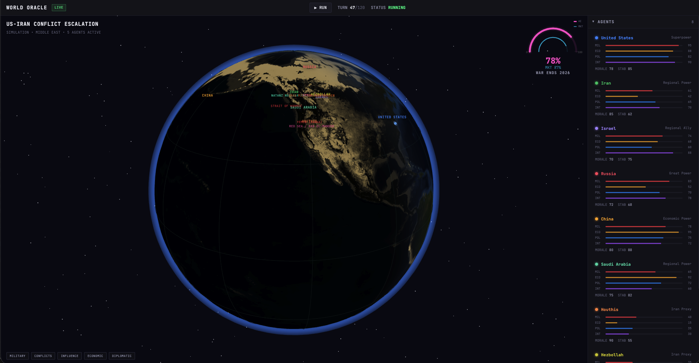

# World Oracle

Gemma 4 powered multi-agent geopolitical simulation platform for the GDG Shanghai Gemma 4 Hackathon.

World Oracle turns a high-stakes global scenario into a live strategic simulation. Each nation, proxy, or institution is represented as an autonomous agent with its own dossier, resources, relationships, durable memory, and tool-call trace. The app visualizes the evolving situation on a 3D globe with agent actions, conflict hotspots, reasoning logs, and outcome probabilities.



## Hackathon Track

**Track A: AI Agent** with a secondary **Track D: Social Good** framing.

The project focuses on crisis anticipation: helping analysts compare possible escalation paths, ceasefire opportunities, humanitarian corridor feasibility, and oil/shipping disruption risk before events harden into real-world consequences.

## Why Gemma 4

Gemma 4 is a strong fit for World Oracle because multi-agent simulation needs repeated local reasoning, structured action selection, and long scenario context.

- **Local open model workflow**: the demo runs against a local OpenAI-compatible Gemma 4 server at `http://127.0.0.1:1234/v1`, avoiding cloud key exposure during judging.
- **Agentic reasoning**: every actor receives a role-specific dossier, the recent world state, prior actor moves, and durable memories before choosing a next action.
- **Function-calling surface**: the app sends Gemma 4 tool schemas such as `propose_agent_action`, then records model tool calls or schema-normalized JSON in the UI.
- **Memory loop**: each turn writes a durable memory item back into the relevant agent so later turns can react to prior commitments.
- **Efficient repeated inference**: the local `google/gemma-4-e4b` model is fast enough for sequential multi-agent turns while preserving the architecture needed to move to larger Gemma 4 variants such as 26B A4B.

## Core Flow

1. **Scenario state**: load the US-Iran conflict escalation fixture with eight strategic actors.
2. **Agent context retrieval**: each agent receives current resources, relationships, recent intelligence, prior actions, and durable memory.
3. **Gemma 4 decision step**: Gemma selects a structured strategic action through function calling when supported, or JSON schema fallback.
4. **Tool execution trace**: the app logs context retrieval, action selection, and memory write-back for reviewer inspection.
5. **World update**: actions become timeline events, action toasts, reasoning entries, and updated outcome probabilities.
6. **Market calibration**: the probability gauge compares Gemma simulation estimates with Polymarket where available.

## Architecture

| Package | Description |
| --- | --- |
| `packages/ui` | React 19 + Vite + Three.js dashboard and Gemma 4 simulation loop |
| `packages/shared` | Shared TypeScript domain models for agents, events, and simulations |

Important files:

- `packages/ui/src/services/gemma.ts` - local Gemma 4 OpenAI-compatible API client, tool schemas, parsing, and normalization.
- `packages/ui/src/services/simulationEngine.ts` - sequential multi-agent turn orchestration.
- `packages/ui/src/stores/simulationStore.ts` - world state, memory updates, action events, and dynamic predictions.
- `packages/ui/src/panels/ReasoningPanel.tsx` - Gemma reasoning, memory, and tool trace display.
- `packages/ui/src/panels/PredictionsPanel.tsx` - live outcome probabilities derived from the latest agent turn.

## Local Setup

Prerequisites:

- Bun 1.3+
- A local OpenAI-compatible server exposing Gemma 4 at `http://127.0.0.1:1234/v1`
- Recommended model for the demo: `google/gemma-4-e4b`

Create env files:

```bash
cp .env.example .env
cp packages/ui/.env.example packages/ui/.env
```

Expected values:

```bash
API_BASE_URL=http://127.0.0.1:1234/v1
OPENAI_API_KEY=local-gemma
VITE_MODEL_NAME=google/gemma-4-e4b
VITE_REPLAY_MODE=false
VITE_MAX_LIVE_GEMMA_AGENTS=1
VITE_GEMMA_TIMEOUT_MS=30000
VITE_DISABLE_POLYMARKET=true
```

`VITE_MAX_LIVE_GEMMA_AGENTS=1` is the recommended local demo setting for slower laptops. Increase it to `2` or `8` when your local Gemma 4 runtime can handle more sequential agent calls.

`VITE_DISABLE_POLYMARKET=true` uses a rotating local live-signal feed in the probability gauge. Set it to `false` to use the real Polymarket CLOB midpoint when network access is reliable.

Install and run:

```bash
bun install
bun run dev
```

UI runs at `http://localhost:3000`.

## Demo Script

1. Start the local Gemma 4 server and confirm `/v1/models` lists `google/gemma-4-e4b`.
2. Run `bun run dev`.
3. Open the dashboard and point out the header model badge.
4. Click **Gemma Turn**.
5. Watch the lead agent use Gemma while secondary actors are scheduler-deferred for a responsive local demo.
6. Open **Agent Reasoning** and show the tool trace: context retrieval, action selection, and memory write-back.
7. Point out the `LIVE` signal in the probability gauge, then open **Predictions** and show how probabilities change after the multi-agent turn.

## Verification

```bash
bun run typecheck
bun run build
```

Package-level checks:

```bash
cd packages/ui
bun run typecheck
bun run build
```

## Submission Notes

For the official repository, submit under:

```text
submissions/2026/A/World-Oracle/
```

Suggested PR title:

```text
[赛道A] World Oracle - <team name>
```

## License

MIT
