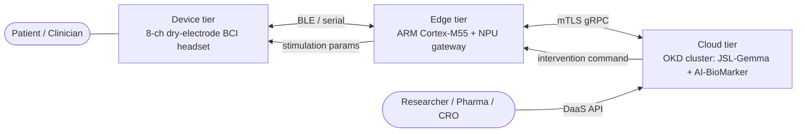
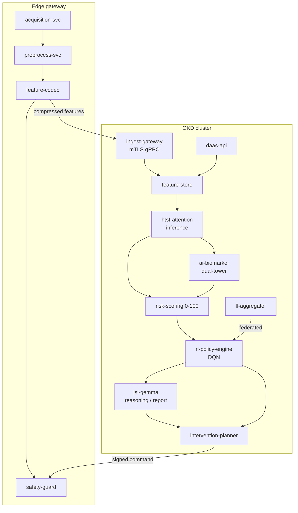
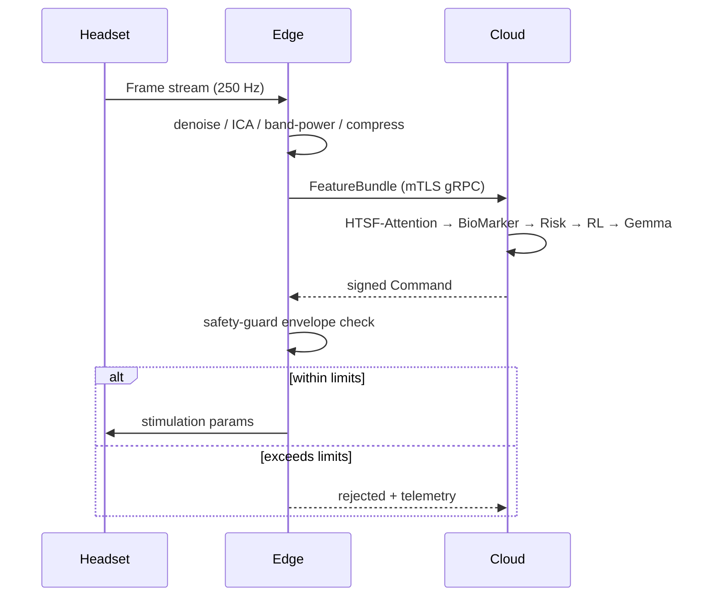
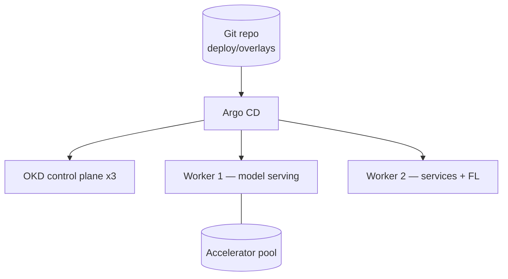

# Architecture — JSL BioMedical

> Engineering scaffold for the non-invasive BCI + AI-BioMarker neuro-immune screening & closed-loop intervention system.
> **Status: MOCK / skeleton.** Module names, contracts, and topology are placeholders to bootstrap a local monorepo. Nothing here is clinically validated; do not ship as-is.

---

## 1. Scope & principles

This document maps the product's **Device → Edge → Cloud** closed loop onto a concrete repository layout, component boundaries, and deployment targets.

Design principles (project conventions):

- **Container-first & immutable.** Every deployable unit ships as an OCI image; no in-place mutation of running nodes.
- **Declarative orchestration.** Cluster state is Git-managed; OKD/Kubernetes is the source of truth, not imperative scripts.
- **Contract-driven boundaries.** Inter-tier communication is defined by versioned schemas (Protobuf/OpenAPI) checked into `proto/` before implementation.
- **DevSecOps by default.** Least-privilege service accounts, image scanning, and signed artifacts gate the pipeline.
- **Edge autonomy.** The edge tier must degrade gracefully and keep the local safety loop alive when the cloud is unreachable.

---

## 2. System context (C4 — level 1)



The loop: **sense → preprocess (edge) → infer (cloud) → decide → stimulate → re-sense**, target round-trip in the low-millisecond range for the local safety path and seconds for the cloud advisory path.

---

## 3. Tier responsibilities

| Tier | Runtime | Owns | Hard constraints |
| --- | --- | --- | --- |
| **Device** | Bare-metal firmware (RTOS) | Signal acquisition (EEG/HRV/EDA @ 250 Hz), stimulation output (tDCS/tACS), hardware current-density clamp | < 50 g, gel-free dry electrodes, fail-safe current cutoff in firmware |
| **Edge** | Linux on ARM (RHEL/AlmaLinux for the dev gateway; embedded RTOS in production) | Real-time denoise, ICA artifact removal, band-power, feature compression (~80%), local safety guard | Runs offline; never trusts a cloud command that violates local safety envelope |
| **Cloud** | OKD cluster (3 control-plane + 2 worker) | HTSF-Attention inference, AI-BioMarker virtual immunomics, JSL-Gemma reasoning, RL policy serving, DaaS | Multi-tenant, data-residency aware, federated-learning aggregator |

---

## 4. Component view (C4 — level 2, cloud tier)



### Module catalog

| Module | Tier | Responsibility | Suggested stack |
| --- | --- | --- | --- |
| `acquisition-svc` | edge | Read ADC streams, timestamp, frame | C / Rust |
| `preprocess-svc` | edge | Filtering, ICA artifact removal, band-power | Rust + DSP libs |
| `feature-codec` | edge | Compress to ~20% payload, schema-tag | Rust |
| `safety-guard` | edge | Enforce current-density/charge envelope on every command | Rust (no_std-friendly) |
| `ingest-gateway` | cloud | mTLS termination, auth, backpressure | Go |
| `feature-store` | cloud | Versioned feature persistence, replay | Python + object store |
| `htsf-attention` | cloud | Time-freq-space model → 504-dim vector | Python / PyTorch, Triton serving |
| `ai-biomarker` | cloud | Dual-tower contrastive → immune state | Python / PyTorch |
| `risk-scoring` | cloud | Fuse outputs → 0–100 score | Python |
| `rl-policy-engine` | cloud | DQN → individualized stim params | Python |
| `jsl-gemma` | cloud | LLM reasoning, evidence-backed report | Gemma + vLLM |
| `intervention-planner` | cloud | Compose & sign final command | Go |
| `fl-aggregator` | cloud | Federated weight aggregation, data stays in-domain | Python |
| `daas-api` | cloud | De-identified data packages for research | Go + OpenAPI |

---

## 5. Repository skeleton (monorepo)

```text
jsl-biomedical/
├── ARCHITECTURE.md
├── README.md
├── README_EN.md
├── proto/                          # versioned contracts — single source of truth
│   ├── signal/v1/frame.proto
│   ├── feature/v1/feature.proto
│   ├── intervention/v1/command.proto
│   └── daas/v1/daas.openapi.yaml
├── device/                         # firmware (out-of-tree build)
│   ├── firmware/
│   ├── hal/
│   └── safety/                     # hardware current clamp
├── edge/
│   ├── acquisition-svc/
│   ├── preprocess-svc/
│   ├── feature-codec/
│   ├── safety-guard/
│   └── Containerfile
├── cloud/
│   ├── ingest-gateway/
│   ├── feature-store/
│   ├── models/
│   │   ├── htsf-attention/
│   │   ├── ai-biomarker/
│   │   └── rl-policy-engine/
│   ├── risk-scoring/
│   ├── intervention-planner/
│   ├── jsl-gemma/
│   ├── fl-aggregator/
│   └── daas-api/
├── deploy/                         # declarative, GitOps-managed
│   ├── docker-compose.yaml         # local dev orchestration
│   ├── base/                       # Kustomize bases
│   ├── overlays/
│   │   ├── dev/
│   │   ├── staging/
│   │   └── prod/
│   ├── helm/                       # charts for stateful deps
│   └── argocd/                     # Application / AppProject manifests
├── ci/
│   ├── pipelines/                  # Tekton / GitHub Actions
│   ├── scan/                       # image + SBOM scanning configs
│   └── sign/                       # cosign / sigstore policy
├── libs/
│   ├── dsp/                        # shared signal-processing
│   ├── schemas/                    # generated stubs from proto/
│   └── telemetry/                  # OTel instrumentation
├── data/
│   ├── fixtures/                   # synthetic EEG for local dev
│   └── schemas/
├── docs/
│   ├── adr/                        # architecture decision records
│   └── runbooks/
├── scripts/
└── test/
    ├── e2e/
    └── load/
```

> For a *local skeleton*, generate empty packages plus a `Containerfile` and a stub `main` per service, wired together with `proto/` stubs and a `compose` or `kind`/`crc` profile under `deploy/overlays/dev/`.

---

## 6. Data flow & contracts

1. **Acquire** — `acquisition-svc` emits `signal.v1.Frame` (raw multimodal frames, 250 Hz).
2. **Preprocess** — `preprocess-svc` denoises + removes artifacts; `feature-codec` emits `feature.v1.FeatureBundle` (compressed).
3. **Ingest** — `ingest-gateway` validates the bundle over mTLS gRPC and writes to `feature-store`.
4. **Infer** — `htsf-attention` → 504-dim vector → `ai-biomarker` + `risk-scoring`.
5. **Decide** — `rl-policy-engine` proposes stimulation params; `jsl-gemma` produces the human-readable, evidence-backed rationale.
6. **Command** — `intervention-planner` emits a signed `intervention.v1.Command`.
7. **Guard & actuate** — `safety-guard` re-checks the command against the local safety envelope **before** the device actuates. A command that exceeds limits is rejected at the edge, regardless of cloud signature.



---

## 7. Deployment topology (OKD)

- **Control plane:** 3 scheduled control-plane nodes.
- **Workers:** 2 dedicated worker nodes; GPU/accelerator pool for `htsf-attention`, `ai-biomarker`, `jsl-gemma`.
- **Serving:** model services behind a Triton/vLLM layer, autoscaled via HPA on request latency.
- **Stateful deps:** object store (feature/model artifacts), time-series DB (telemetry), Postgres (DaaS metadata) — provisioned via operators where available.
- **GitOps:** Argo CD reconciles `deploy/overlays/<env>` against the cluster; promotions are PRs between overlays.
- **Federated learning:** `fl-aggregator` only receives gradient/weight updates; raw patient data never leaves its origin domain.



---

## 8. Cross-cutting concerns

- **Security / DevSecOps:** per-service least-privilege ServiceAccounts; images scanned + SBOM generated in CI; artifacts signed (cosign) and verified by an admission policy before deploy. Secrets via the cluster secret store, never in Git.
- **Observability:** OpenTelemetry traces span device→edge→cloud; the closed-loop round-trip is a first-class SLI.
- **Safety invariants:** current-density and total-charge limits are enforced in **two independent places** — device firmware and edge `safety-guard` — so a single compromised tier cannot over-stimulate.
- **Data governance:** DaaS outputs are de-identified at `daas-api`; residency tags travel with every `FeatureBundle`.
- **Testing:** synthetic EEG fixtures under `data/fixtures/` enable full local e2e without hardware; load tests target the cloud advisory path.

---

## 9. Local bootstrap (suggested next steps)

1. Define schemas in `proto/` and generate stubs into `libs/schemas/`.
2. Scaffold one stub service per module with a health endpoint + `Containerfile`.
3. Stand up `deploy/overlays/dev/` for `crc`/`kind`, wired with synthetic fixtures.
4. Add a CI pipeline that builds, scans, signs, and renders manifests.
5. Replace stubs tier-by-tier, starting with the `safety-guard` invariant and the `proto/` contracts.

---

> Decisions of consequence should be recorded as ADRs under `docs/adr/`. This file is the *map*; the ADRs are the *history*.
