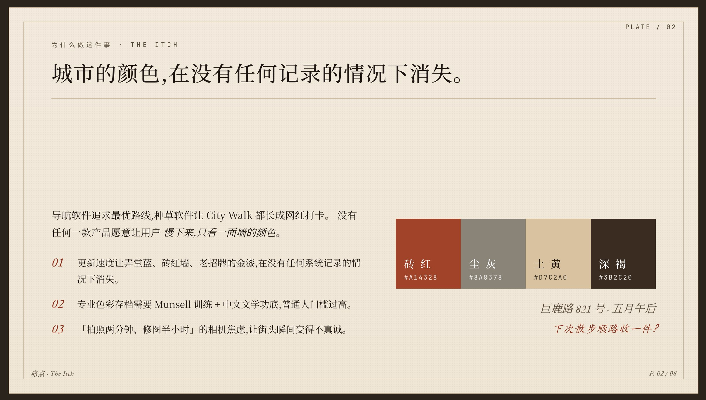
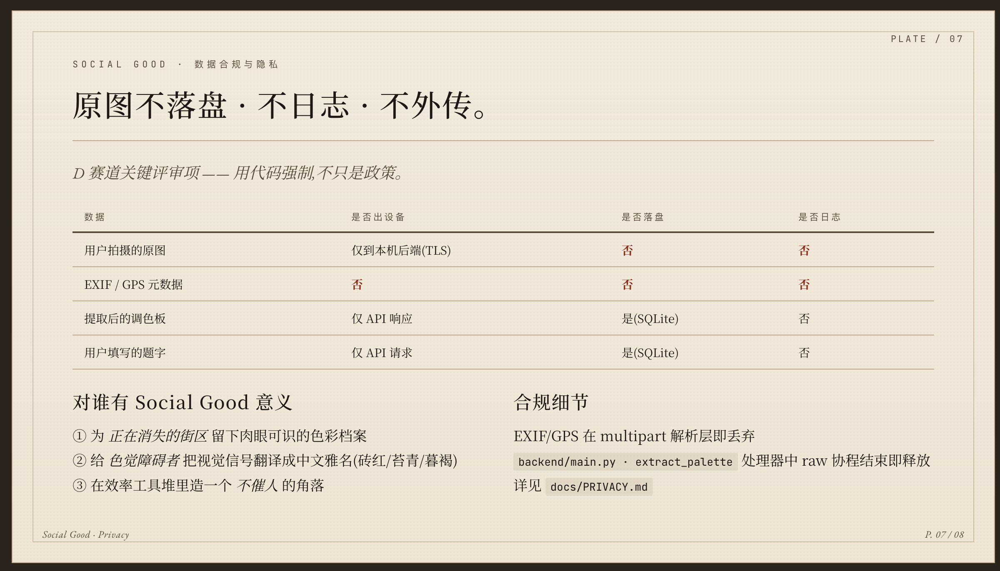
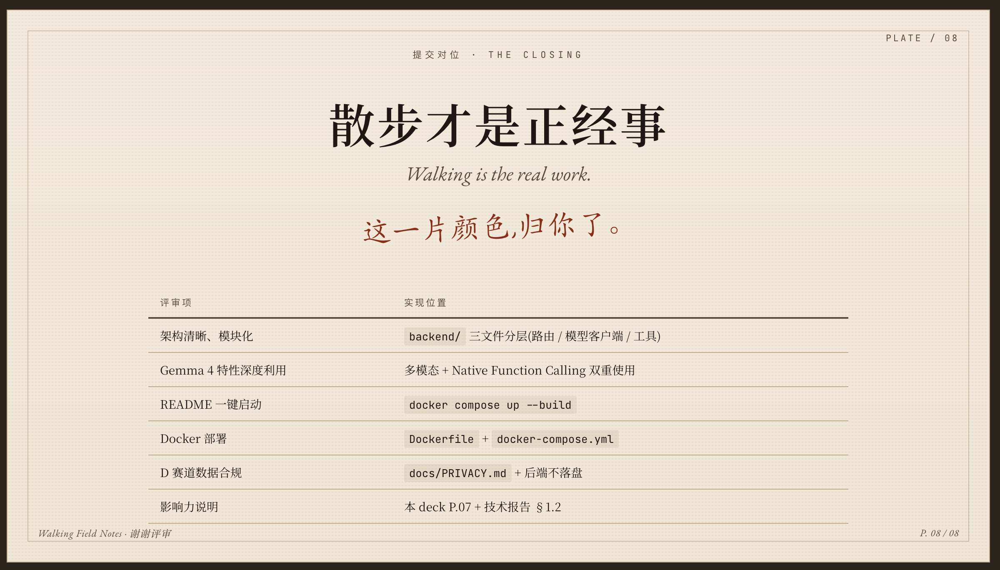

# 散步才是正经事

> *Field Notes · v.06 · 壹 · 五月图鉴册*
>
> 一个让人像 *城市感性人类学者* 一样,把散步当成正经事去做的容器。

## 这是什么

不是一个城市探索 app。
不是一个种草打卡 app。
不是一个让你「拍照两分钟、修图半小时」的相机。

这是一本可以握在手里的 *城市标本夹*。
你走过一面砖墙、一片落叶、一块旧招牌,觉得它的颜色值得保留 ——
按下快门,模型替你提出 4 种主色并写下中文雅名,
你只需要选一个维度、留一句话,然后看它像蝴蝶标本一样合页入册。

整个 app 只有三件事可以做:**走路、采一片颜色、翻看图鉴册**。
其余被刻意删掉。

## 三个方向,只走两条

设计阶段里有三个互斥的方向,每一个都很美,但黑客松的几十小时只够把两条做透。

| 方向 | 核心理念 | 现在的取舍 |
|------|---------|-----------|
| 一 · 城市标本夹 | 像旧笔记本一样的极简地方志,大字报排版 + 复古衬线 | **完全采纳** —— 整本图鉴册的语言、版式、印章 |
| 二 · 盲目浪漫(迷雾轨迹) | 反导航,把游荡留成星图 | 暂留接口(底栏 *地图* tab),不在本次 demo 范围 |
| 三 · 城市色谱 | 像潘通色卡一样的多色块视觉,提取局部颜色并感性命名 | **完全采纳** —— 是采集流程 Step 2 的全部 |

最终落地是 **一 + 三的融合**:用标本夹的 *容器* 装色谱的 *肌肉*。
做减法的难处不是少做,是 *知道哪些不做也成立*。

## 一次散步的完整轨迹

```
按下双击 → 取景器对住一片砖墙
            (Frame · F 2.8 · 1/250)
   ↓
拍下      → 模型看图,选出 4 种主色
            砖红 / 尘灰 / 土黄 / 深褐
            (Extract · 自动取色完成,可改写名称)
   ↓
题字      → 留空也行,模型替你拟一句
            「光从砖缝里抖落,像旧年寄的信」
   ↓
入册      → No. 0244 · 收
            合页时会盖一个手写印章
```

四步之外没有别的。
没有点赞、没有转发、没有信息流、没有路线推荐。

## Gemma 4 在哪

我们没有把 Gemma 4 当成卖点,而是把它放在 *用户感觉不到它存在的位置* —

- 当你按下快门,它替你看图,把这片色彩翻译成 4 个 hex + 中文雅名;
- 当你想偷懒不题字,它替你写一句不超过 18 字的散文式短句;
- 题字之前,它会主动调一次工具去查这条街是否在城市历史风貌保护名录;命中了,
  入册的那一页会安静地多出一行说明。

视觉提取走的是 **Gemma 4 4B Multimodal**;
工具调用走的是它的 **Native Function Calling**(不是拼 prompt 假装的工具调用,
是模型自己决定何时调、调几次)。
具体的接法和取舍在 `docs/TECHNICAL_REPORT.md`。

## 它在审美上的执念

| 元素 | 出处 |
|------|------|
| 中文衬线 | Noto Serif SC,300/400/500/600 四档 |
| 西文衬线 | EB Garamond,带 italic |
| 手写体 | Caveat —— 只用来写印章和「下次散步顺路收一件?」这种私语 |
| 等宽 | JetBrains Mono —— 只用来写经纬度、ISO 200、F 2.8 |
| 纸色 | 日 / 黄昏 / 夜,三档纸色背景 |
| 留白 | 卡片之间永远空着至少 24px,不挤满 |
| 印章 | 「新」「采」「收」三个字的红朱印,位置随机轻微旋转 |

这些不是 *配置项*,是 *规则*。Tweaks 面板里能改的只有 4 项:
纸色、主题色、密度、是否显示采集印章。
其余审美决定 *不交给用户*,因为这本图鉴册不是给用户的工具,
是给用户的 *作品*。

## 一键启动

```bash
cd submissions/2026/track_D/walking_is_the_real_work

# 离线评审模式(stub),5 秒可用,无需 GPU
docker compose up --build
open http://localhost:8000/walking-app.html

# 真模型推理(需要 Gemma 4 4B Multimodal 权重)
GEMMA_STUB=0 docker compose up --build
```

## 项目结构

```
walking_is_the_real_work/
├── frontend/                   React iOS-frame demo
│   ├── walking-app.html        入口,注入 GEMMA_API_BASE
│   ├── walking-app.jsx         路由 / 底栏 / 图鉴 feed
│   ├── screen-capture.jsx      四步采集流程,接 Gemma 4 后端
│   ├── specimens.jsx           图鉴卡片渲染
│   └── app-styles.css          所有审美规则的真正出处
├── backend/                    FastAPI · Gemma 4 客户端
│   ├── main.py                 路由 / 静态托管
│   ├── gemma_client.py         多模态 + Native Function Calling
│   └── tools.py                lookup_district_archive / save_specimen
├── docs/
│   ├── TECHNICAL_REPORT.md     模型选型 / 架构 / 隐私
│   ├── PRIVACY.md              D 赛道合规说明
│   ├── demo.mp4                63 秒项目演示视频
│   └── presentation/           项目介绍图
├── sample_data/                合规样本说明(不附原图)
├── requirements.txt
├── Dockerfile
├── docker-compose.yml
└── .env.example
```

## 提交资料对位

| 大赛要求 | 本仓库位置 |
|---------|-----------|
| 核心代码 + Gemma 4 调用 | `backend/gemma_client.py` |
| Native Function Calling 展示 | 同上 `inscribe_with_tools` |
| 多模态处理 | 同上 `extract_palette` |
| README + 一键启动 | 本文件 + `Dockerfile` |
| 技术报告 | `docs/TECHNICAL_REPORT.md` |
| 数据合规(D 赛道关键) | `docs/PRIVACY.md` + `sample_data/README.md` |
| 演示视频 | [`docs/demo.mp4`](docs/demo.mp4) |
| 项目介绍图 | [`docs/presentation/`](docs/presentation/) |

## 项目介绍图

<p>
  <a href="docs/presentation/plate-02-pain-point.jpg"></a>
  <a href="docs/presentation/plate-07-privacy.jpg"></a>
  <a href="docs/presentation/plate-08-closing.jpg"></a>
</p>

## 写在最后

这不是一个对抗性产品,它不试图替代任何东西。
它只是想留住一种正在被效率工具吃掉的习惯 ——
出门走两步,看见一面墙的颜色好看,就停下来,真的停下来。

> *残缺的、未经雕琢的街头记录,才是最珍贵的城市标本。*
